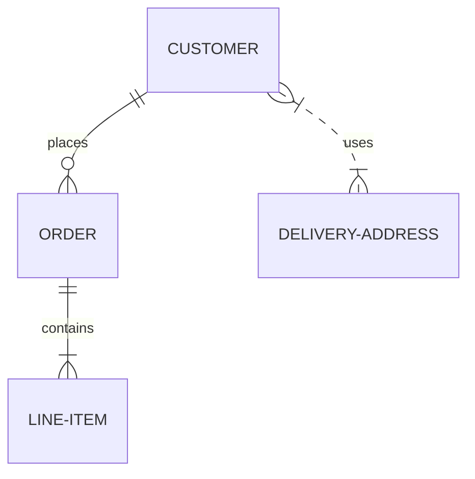

# Mermaid-Maker

This action converts [mermaid](https://github.com/mermaid-js/mermaid) files into one of the output formats: png, svg, pdf.

## What is Mermaid?

Mermaid is a popular diagramming tool written with JS. It uses a unique syntax to generate flow charts, class diagrams, quadrant charts, etc...

Here's an example of mermaid syntax:

```
erDiagram
    CUSTOMER ||--o{ ORDER : places
    ORDER ||--|{ LINE-ITEM : contains
    CUSTOMER }|..|{ DELIVERY-ADDRESS : uses
```

Mermaid would then convert the previous syntax into the following diagram:



## Why Use This Action?

One key aspect about Mermaid is that it's a client-side library. It uses the DOM to render diagrams.

This means that mermaid diagrams are rendered on the client, adding additional latency to your app. 

### So, What are the Existing Solutions?

#### A) Live the Easy Life

Well, technically, the first solution is to not worry about it... However, a webpage will take longer to load on every rerender.

---

#### B) Async & Caching

One solution is rendering mermaid diagrams asyncronously and caching them between rerenders. This allows you to render most of your webpage while using placeholders/lazy loading for mermaid diagrams. Then, caching the mermaid diagrams makes it load faster on rerenders. 

This is good enough for use-cases where:

1. Initial speed of loading diagrams isn't a priority

2. A given webpage only contains a few, simpler diagrams

3. You don't mind the added complexity (async, caching, placeholders/suspense)

---

#### C) Diagrams as Static Assets

Another solution is using `mermaid-js/mermaid-cli` to render mermaid diagrams on your machine, before pushing them as static assets to your repo.

This is also good enough for use-cases where:

1. You're working on internal/individual projects. With collaborative (esp. open-source) projects, you need to check and/or protect against scripting attacks with SVGs. You can use PNGs to skip this step.

2. You're willing to figure out how to set up the mermaid cli (downloading headless browsers, sandboxing, generating new mermaid diagrams with every change).

---

### This Solution

Or... **you can use this solution**. This Github action checks for any added or modified mermaid source files, and it renders them to your chosen output. 

This solution is:

1. Simpler. On your dev environment, you can load mermaid diagrams on the client without async/placeholders/caching. Then, in prod, your webapp can use the generated SVGs as static assets.

2. You don't need to worry about Mermaid's cli, sandboxing puppeteer or downloading web browsers.

3. More secure because SVGs are generated by GitHub actions rather than individual collaborators. 

## Usage

TBD...